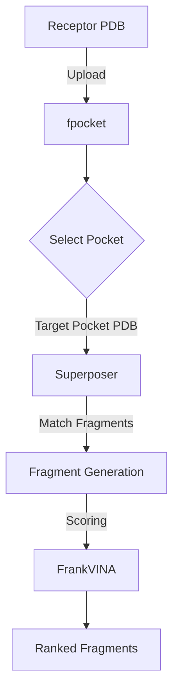

# FrankPEPstein

**FrankPEPstein** is a tool for designing peptide fragments that bind to specific protein pockets. It integrates `fpocket` for pocket detection, `superposer` for fragment generation, and `FrankVINA` for scoring and ranking.

## Pipeline Overview

## How to use

The easiest way to run FrankPEPstein is via Google Colab.

1.  Click the **Open In Colab** badge above.
2.  **Setup Pipeline**: Run the first cell to install dependencies and configure the environment.
    *   *Note:* You will need to provide Google Drive File IDs for the database and external tools in this step.
3.  **Upload Receptor**: Upload your target protein structure (PDB format).
4.  **Select Pocket**: Use the interactive viewer to choose the binding pocket.
5.  **Run Pipeline**: Execute the subsequent cells to generate and score fragments.
6.  **Download**: Get your results as a ZIP file.

## Repository Structure

*   `scripts/`: Python scripts for variable tasks (superposer, scoring, clustering).
*   `utilities/`: Helper tools (ADFR, Click).
*   `DB/`: Database files (MiniPockets, Dictionaries).
*   `FrankPEPstein.ipynb`: Main interactive notebook.
