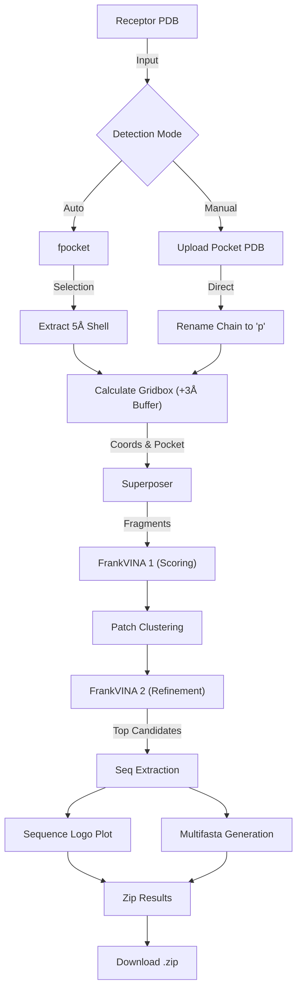

# FrankPEPstein

[](https://colab.research.google.com/github/Joacaldog/FrankPEPstein/blob/main/FrankPEPstein.ipynb)

**FrankPEPstein** is a structure-guided pipeline for de novo peptide design. It identifies binding pockets on a target receptor, generates candidate peptide fragments using database mining (`superposer`), and ranks them using Vina docking (`FrankVINA`).

## Pipeline Overview



## How to use (Google Colab)

The primary interface is the interactive [Google Colab Notebook](https://colab.research.google.com/github/Joacaldog/FrankPEPstein/blob/main/FrankPEPstein.ipynb).

### 1. Setup
Run the first cell. This will:
*   Install system dependencies (ADFR, etc.).
*   Install Python packages (`py3Dmol`, `logomaker`, `biopython`).
*   Download the required databases and tools archive (`files.tar.gz`) from Google Drive.

### 2. Pocket Processing
*   **Upload Receptor**: Upload your target protein PDB.
*   **Select Mode**:
    *   **Auto Detect**: Uses `fpocket` to find potential binding sites. Select one from the dropdown to extract it (residues within 5Å are preserved).
    *   **Manual Upload**: Upload a pre-defined pocket PDB. It will be used directly to define the gridbox.
*   **Visualisation**: The receptor (white surface) and selected pocket (colored sphere) are displayed.
*   **Gridbox**: The script automatically calculates a gridbox centered on the pocket with a **3.0 Å buffer** beyond the pocket atoms.

### 3. Run Generation
*   **Configure**:
    *   **Peptide Size**: Length of peptides to generate (e.g., 8-mer).
    *   **Threads**: CPU cores to use.
    *   **Candidates**: Number of top peptides to refine in the final step.
*   **Visualize**: The generated seed fragments appear in the viewer. The pocket is shown as a white ghost surface, and new fragments appear as green dots (stable static visualization).

### 2.5. Visualize Candidates
After generation, visualize the final results in 3D:
*   Displays the **Receptor** (White Surface/Cartoon).
*   Displays the **Pocket** (Orange Surface).
*   Displays the **Gridbox** (Thick Red Wireframe).
*   Displays the **Top Candidates** (Green Sticks).

### 3. Analysis
The pipeline automatically:
*   Extracts amino acid sequences from the top candidate PDBs.
*   Aligns them to generate a **Multifasta** file.
*   Generates a **Sequence Logo** plot showing conserved motifs.

### 5. Download
Click the download button to get a ZIP file containing:
*   Top candidate PDB structures.
*   `candidates.fasta` (Aligned sequences).
*   `logo.png` (Sequence logo chart).

---

## Local Execution

You can run the pipeline locally using `scripts/run_local.py`.

### Prerequisites
*   Linux environment with `conda` or `mamba`.
*   Python 3.10+.

### Setup

Run the following script to create the environment, download databases, and configure tools:

```bash
python3 scripts/setup_local.py
```

Arguments:
*   `--key`: Modeller license key (default: 'MODELIRANJE').

Then activate the environment:
```bash
conda activate FrankPEPstein
```

### Usage

```bash
python3 scripts/run_local.py \
  --receptor my_receptor.pdb \
  --pocket my_pocket.pdb \
  --pep_size 8 \
  --threads 36 \
  --candidates 10
```

**What this does:**
1.  Copies your receptor and pocket to the run directory.
2.  Standardizes the pocket (renames chain to 'p', saves to `pockets/pocket.pdb`).
3.  Calculates the Gridbox parameters locally.
4.  Executes `scripts/run_FrankPEPstein.py` with the correct arguments.

---

## Developer Guide

The codebase is organized to separate Logic from UI.

*   **`functions/`**: Contains the interactive UI code used in the Colab notebook (`step_0`, `step_1`, etc.).
*   **`scripts/`**: Contains the core logic scripts (`run_FrankPEPstein.py`, `superposer.py`, etc.).

### Updating the Notebook
If you modify any file in `functions/`:
1.  Run the generator script:
    ```bash
    python3 scripts/generate_notebook.py
    ```
2.  This updates `FrankPEPstein.ipynb` automatically.
3.  Commit both the modified python files and the unified notebook.
